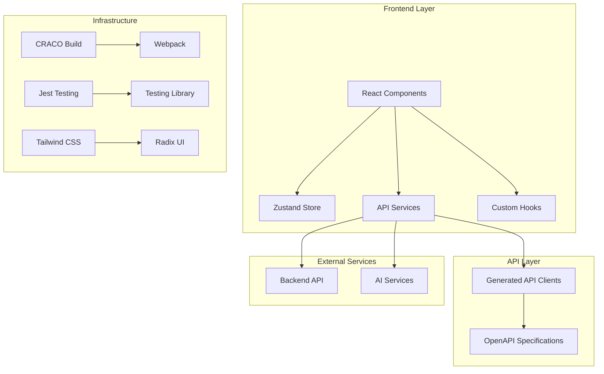
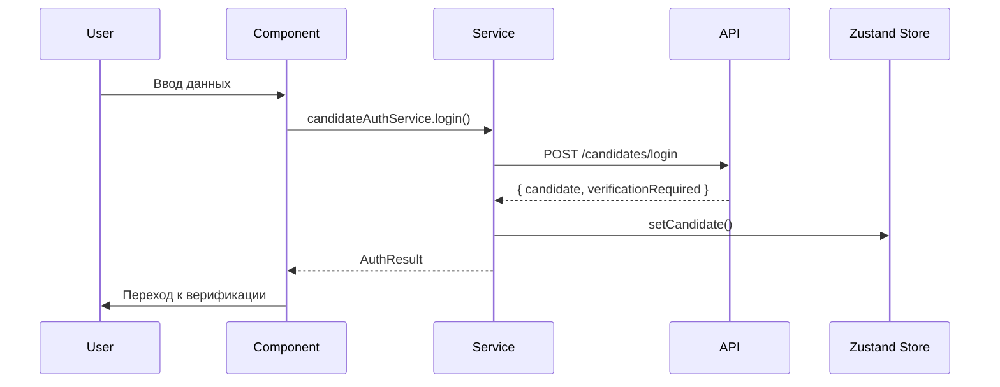
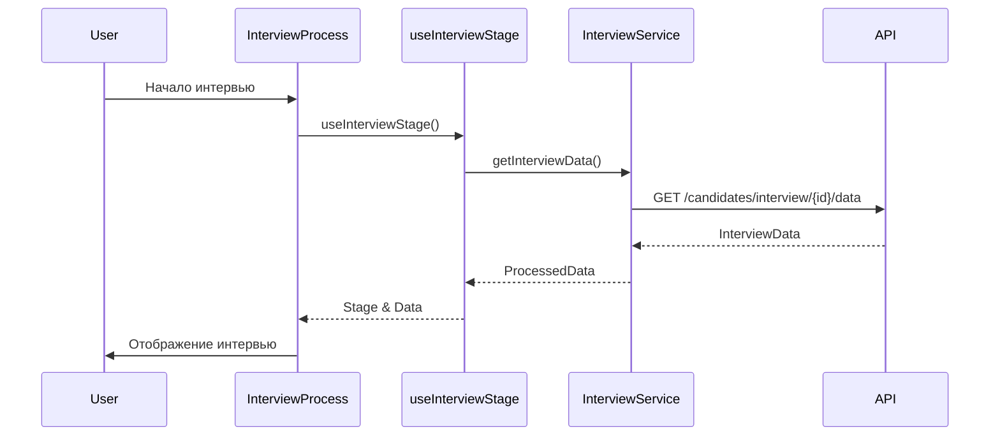

    # 🏗️ Архитектурная документация

**Проект:** HR Recruiter Frontend  
**Версия:** 0.1.0  
**Дата:** 2025-01-27

## 📋 Обзор архитектуры

HR Recruiter Frontend построен на современном стеке технологий с акцентом на модульность, типизацию и производительность. Приложение следует принципам чистой архитектуры и разделения ответственности.

### 🎯 Архитектурные принципы

- **Модульность** - Четкое разделение на функциональные модули
- **Типизация** - Строгая типизация с TypeScript
- **Переиспользование** - Общие компоненты и утилиты
- **Тестируемость** - Покрытие тестами критической функциональности
- **Производительность** - Оптимизация рендеринга и загрузки

## 🏛️ Общая архитектура



## 📁 Структура проекта

### Корневая структура

```
hr-candidate-front/
├── src/                    # Исходный код
├── public/                 # Статические файлы
├── api/                    # OpenAPI спецификации
├── generated-src/          # Автогенерируемый код
├── scripts/                # Скрипты сборки и утилиты
├── docs/                   # Документация
├── info/                   # Технические отчеты
└── tests/                  # Тесты
```

### Детальная структура src/

```
src/
├── candidate/              # Кандидатская часть
│   ├── components/         # UI компоненты
│   │   ├── interview/      # Компоненты интервью
│   │   ├── ui/            # Базовые UI компоненты
│   │   └── common/        # Общие компоненты
│   ├── pages/             # Страницы приложения
│   ├── services/          # API сервисы
│   ├── hooks/             # React хуки
│   ├── types/             # TypeScript типы
│   ├── styles/            # Стили
│   └── utils/             # Утилиты
├── admin/                 # Административная часть
├── api/                   # API клиенты
├── store/                 # Zustand хранилища
├── services/              # Общие сервисы
└── utils/                 # Общие утилиты
```

## 🔧 Технологический стек

### Основные технологии

| Технология | Версия | Назначение |
|------------|--------|------------|
| React | 18.2.0 | UI библиотека |
| TypeScript | 4.9.5 | Типизация |
| Tailwind CSS | 3.3.6 | Стилизация |
| Zustand | 5.0.6 | Управление состоянием |
| React Router | 6.20.1 | Роутинг |
| Axios | 1.6.2 | HTTP клиент |

### UI библиотеки

| Библиотека | Назначение |
|------------|------------|
| Radix UI | Базовые компоненты |
| Framer Motion | Анимации |
| Lucide React | Иконки |
| React Hook Form | Формы |
| Zod | Валидация |

### Инструменты разработки

| Инструмент | Назначение |
|------------|------------|
| CRACO | Конфигурация Webpack |
| Jest | Тестирование |
| Testing Library | Тестирование компонентов |
| ESLint | Линтинг |
| OpenAPI Generator | Генерация API клиентов |

## 🏗️ Архитектурные слои

### 1. Presentation Layer (Слой представления)

**Назначение:** Отображение UI и обработка пользовательских взаимодействий

**Компоненты:**
- React компоненты в `src/candidate/components/`
- Страницы в `src/candidate/pages/`
- UI компоненты в `src/candidate/components/ui/`

**Принципы:**
- Компоненты должны быть чистыми (Pure Functions)
- Минимальная бизнес-логика в компонентах
- Использование хуков для состояния

```typescript
// Пример чистого компонента
interface ButtonProps {
  onClick: () => void;
  children: React.ReactNode;
  variant?: 'primary' | 'secondary';
}

export const Button: React.FC<ButtonProps> = ({ 
  onClick, 
  children, 
  variant = 'primary' 
}) => {
  return (
    <button 
      className={`btn btn-${variant}`}
      onClick={onClick}
    >
      {children}
    </button>
  );
};
```

### 2. Business Logic Layer (Слой бизнес-логики)

**Назначение:** Содержит бизнес-правила и логику приложения

**Компоненты:**
- Custom hooks в `src/candidate/hooks/`
- Zustand stores в `src/store/`
- Утилиты в `src/utils/`

**Принципы:**
- Бизнес-логика отделена от UI
- Переиспользуемые хуки
- Централизованное управление состоянием

```typescript
// Пример бизнес-логики в хуке
export const useInterviewStage = (interviewId: number) => {
  const [stage, setStage] = useState<InterviewStage>('welcome');
  const [loading, setLoading] = useState(false);
  
  const nextStage = useCallback(() => {
    // Бизнес-логика перехода между стадиями
    setStage(getNextStage(stage));
  }, [stage]);
  
  return { stage, loading, nextStage };
};
```

### 3. Data Access Layer (Слой доступа к данным)

**Назначение:** Взаимодействие с API и внешними сервисами

**Компоненты:**
- API сервисы в `src/candidate/services/`
- Автогенерируемые клиенты в `src/api/`
- HTTP утилиты

**Принципы:**
- Абстракция над HTTP запросами
- Типизированные API вызовы
- Централизованная обработка ошибок

```typescript
// Пример API сервиса
export class CandidateApiService {
  private apiClient: ApiClient;
  
  constructor(apiClient: ApiClient) {
    this.apiClient = apiClient;
  }
  
  async getInterviewData(interviewId: number): Promise<InterviewData> {
    try {
      const response = await this.apiClient.candidates.getInterviewData(interviewId);
      return response.data;
    } catch (error) {
      throw new ApiError('Failed to fetch interview data', error);
    }
  }
}
```

### 4. Infrastructure Layer (Инфраструктурный слой)

**Назначение:** Конфигурация, утилиты, внешние зависимости

**Компоненты:**
- Конфигурация в `craco.config.js`
- Утилиты в `src/utils/`
- Скрипты в `scripts/`

## 🔄 Потоки данных

### 1. Поток аутентификации



### 2. Поток интервью



## 🗄️ Управление состоянием

### Zustand Store

**Структура:**
```typescript
interface AuthStore {
  // Состояние
  candidate: Candidate | null;
  token: string | null;
  isAuthenticated: boolean;
  
  // Действия
  setCandidate: (candidate: Candidate) => void;
  setToken: (token: string) => void;
  logout: () => void;
  restoreSession: () => Promise<void>;
}
```

**Принципы:**
- Минимальное состояние в store
- Асинхронные действия через async/await
- Персистентность через localStorage

### Локальное состояние

**Использование useState для:**
- UI состояния (модальные окна, формы)
- Временных данных
- Состояния компонентов

**Использование useReducer для:**
- Сложной логики состояния
- Множественных связанных состояний

## 🔌 API интеграция

### Автогенерация клиентов

**Процесс:**
1. OpenAPI спецификация в `api/openapi-candidates.yaml`
2. Генерация через `npm run generate:api`
3. Типизированные клиенты в `src/api/`

**Преимущества:**
- Автоматическая синхронизация с бэкендом
- Типизированные запросы и ответы
- Валидация на уровне TypeScript

### Обработка ошибок

**Стратегия:**
```typescript
// Централизованная обработка ошибок
export const handleApiError = (error: any): string => {
  if (error.response?.data?.message) {
    return error.response.data.message;
  }
  if (error.message) {
    return error.message;
  }
  return 'Произошла неизвестная ошибка';
};
```

## 🎨 Стилизация

### Tailwind CSS

**Конфигурация:**
- Кастомные цвета в `tailwind.config.js`
- CSS переменные для тем
- Утилитарные классы

**Принципы:**
- Мобильный подход (Mobile First)
- Компонентная стилизация
- Переиспользование стилей

### Radix UI

**Использование:**
- Базовые компоненты (Button, Input, Modal)
- Доступность из коробки
- Кастомизация через CSS

## 🧪 Тестирование

### Стратегия тестирования

**Пирамида тестов:**
1. **Unit тесты** - Утилиты, хуки, сервисы
2. **Integration тесты** - Компоненты с API
3. **E2E тесты** - Полные пользовательские сценарии

**Покрытие:**
- Критическая бизнес-логика: 100%
- Компоненты: 80%+
- Утилиты: 90%+

### Инструменты

- **Jest** - Test runner
- **Testing Library** - Тестирование компонентов
- **MSW** - Mock Service Worker для API

## 🚀 Производительность

### Оптимизации

**React:**
- React.memo для предотвращения лишних рендеров
- useMemo/useCallback для дорогих вычислений
- Lazy loading для больших компонентов

**Bundle:**
- Code splitting по роутам
- Tree shaking неиспользуемого кода
- Оптимизация изображений

**Runtime:**
- Debounce для поиска и форм
- Виртуализация длинных списков
- Оптимизация re-renders

## 🔒 Безопасность

### Принципы безопасности

1. **Валидация данных** - Zod схемы
2. **Санитизация** - Очистка пользовательского ввода
3. **HTTPS** - Обязательно в продакшене
4. **Токены** - JWT с истечением срока

### Уязвимости

**Защита от:**
- XSS атак
- CSRF атак
- Injection атак
- Clickjacking

## 📊 Мониторинг

### Логирование

**Уровни:**
- ERROR - Критические ошибки
- WARN - Предупреждения
- INFO - Информационные сообщения
- DEBUG - Отладочная информация

**Структура:**
```typescript
logger.info('User action', {
  action: 'login',
  userId: user.id,
  timestamp: new Date().toISOString()
});
```

### Метрики

- **Web Vitals** - Core Web Vitals
- **API Performance** - Время ответа API
- **Error Rate** - Частота ошибок
- **User Actions** - Пользовательские действия

## 🔄 CI/CD

### Pipeline

1. **Lint** - ESLint проверка
2. **Test** - Запуск тестов
3. **Build** - Сборка приложения
4. **Deploy** - Развертывание

### Качество кода

- **Pre-commit hooks** - Husky
- **Code review** - Обязательно
- **Automated testing** - На каждый PR

## 📈 Масштабируемость

### Горизонтальное масштабирование

- **Микросервисная архитектура** - Разделение на модули
- **CDN** - Статические ресурсы
- **Load balancing** - Распределение нагрузки

### Вертикальное масштабирование

- **Оптимизация bundle** - Уменьшение размера
- **Lazy loading** - Загрузка по требованию
- **Caching** - Кэширование данных

## 🎯 Рекомендации по развитию

### Краткосрочные (1-2 месяца)

1. **Рефакторинг дублирующихся компонентов**
2. **Исправление падающих тестов**
3. **Улучшение обработки ошибок**

### Среднесрочные (3-6 месяцев)

1. **Внедрение Storybook** для компонентов
2. **Увеличение покрытия тестами**
3. **Оптимизация производительности**

### Долгосрочные (6+ месяцев)

1. **Миграция на Next.js** для SSR
2. **Внедрение PWA** функций
3. **Интернационализация** (i18n)

---

**Документ поддерживается командой разработки**  
**Последнее обновление:** 2025-01-27
