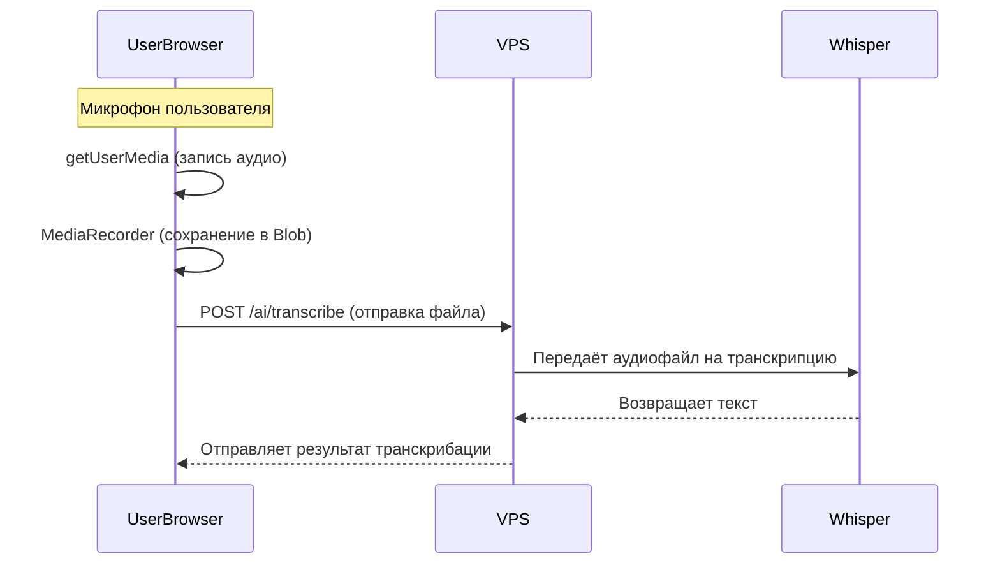

# Работа с микрофоном и аудио в HR Recruiter

## Правильная архитектура для VPS без микрофона

### Проблема
- На VPS (Ubuntu, Docker) нет физического микрофона
- `getUserMedia` работает только в браузере
- Сервер может только обрабатывать уже записанные файлы

### Решение
**Вся запись аудио происходит в браузере, сервер только обрабатывает файлы.**

## Архитектура



## Реализация

### 1. Клиент (браузер)
- Использует `getUserMedia` для доступа к микрофону
- Использует `MediaRecorder` для записи аудио
- Отправляет файлы на сервер через API

### 2. Сервер (VPS)
- Принимает аудиофайлы через REST API
- Обрабатывает файлы через Whisper/Claude
- Возвращает результаты транскрибации

## Примеры API для транскрибации

### 1. /ai/transcribe

**POST /ai/transcribe**

- **Описание:** Транскрибировать аудиофайл.
- **Request:**  multipart/form-data, поле `audio` (binary, required)
- **Response:** 200 OK, поле `transcript` (string)

**Пример запроса:**
```http
POST /ai/transcribe
Content-Type: multipart/form-data

audio: <binary file>
```
**Пример ответа:**
```json
{
  "transcript": "Транскрибированный текст"
}
```

---

### 2. /ai/transcribe-answer

**POST /ai/transcribe-answer**

- **Описание:** Транскрибировать и отформатировать аудиоответ на интервью (пайплайн: Whisper → Claude → сохранение в БД).
- **Request:**  multipart/form-data, поля:
    - `audioFile` (binary, required)
    - `interviewId` (integer, required)
    - `questionId` (integer, required)
- **Response:** 200 OK, поля:
    - `success` (boolean)
    - `formattedText` (string)
    - `interviewAnswerId` (integer)

**Пример запроса:**
```http
POST /ai/transcribe-answer
Content-Type: multipart/form-data

audioFile: <binary file>
interviewId: 123
questionId: 456
```
**Пример ответа:**
```json
{
  "success": true,
  "formattedText": "Я работал в компании три года, занимался разработкой на Java.",
  "interviewAnswerId": 789
}
```

---

## Примечания

- Не реализуйте работу с микрофоном на сервере — это невозможно и не требуется для вашей архитектуры.
- Все примеры с getUserMedia должны быть только в клиентском коде (React, Vue и т.д.).
- Для улучшения качества транскрипции используйте lossless-форматы (например, WAV) и минимизируйте шумы на клиенте. 