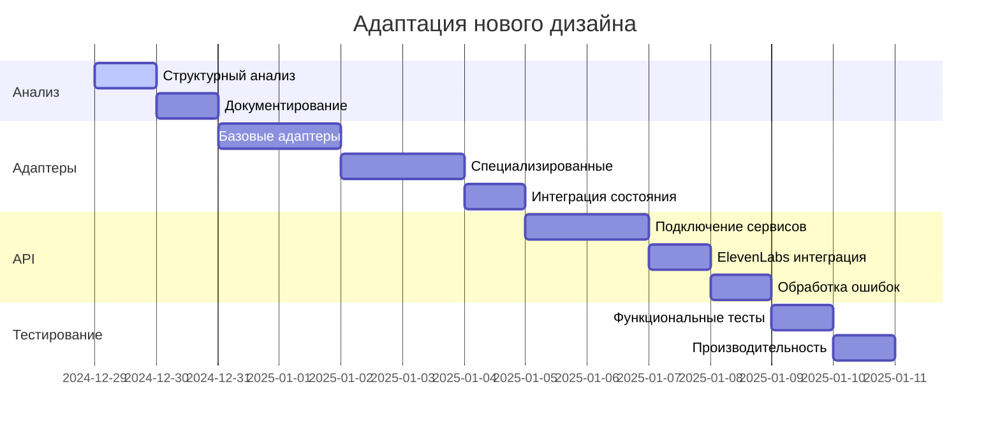

# ПЛАН РЕАЛИЗАЦИИ - АДАПТАЦИЯ НОВОГО ДИЗАЙНА

## Быстрая интеграция готовой верстки с существующим функционалом

### ВЕРСИЯ: 2.0.0

### ДАТА: 28.12.2024

### СТАТУС: ГОТОВ К АДАПТАЦИИ НОВОГО ДИЗАЙНА

---

## 🎯 EXECUTIVE SUMMARY

### 1.1 Новая стратегия

✅ **Подход**: Адаптация готового дизайна БЕЗ изменений  
✅ **Приоритет**: Сохранение UX/UI нового дизайна  
✅ **Метод**: Создание адаптеров между дизайном и функционалом  
✅ **Срок**: 1-2 недели вместо 2-3 месяцев  

### 1.2 Текущее состояние

✅ **Готово к интеграции (95%)**:

- Существующий функционал полностью работает
- API клиенты сгенерированы и протестированы
- Состояние приложения управляется через Zustand
- ElevenLabs интеграция настроена
- Тестовое покрытие основных компонентов

⚠️ **Требует адаптации (5%)**:

- Подключение нового дизайна к существующему функционалу
- Создание адаптеров для интеграции
- Тестирование совместимости

### 1.3 Приоритеты адаптации

1. **HIGH**: Сохранение нового дизайна без изменений
2. **HIGH**: Быстрая интеграция с существующим функционалом
3. **MEDIUM**: Оптимизация производительности
4. **LOW**: Дополнительные улучшения

---

## 2. ФАЗА 1: АНАЛИЗ НОВОГО ДИЗАЙНА (1-2 дня)

### 2.1 Day 1: Структурный анализ

#### 2.1.1 Анализ компонентов

**Задача**: Изучить структуру нового дизайна и выявить точки интеграции

```typescript
// Карта компонентов для анализа
interface ComponentAnalysis {
  [componentName: string]: {
    purpose: string;                    // Назначение компонента
    props: string[];                    // Входные параметры
    events: string[];                   // События компонента
    integrationPoints: string[];        // Точки интеграции с API
    stateDependencies: string[];        // Зависимости от состояния
  }
}

// Пример анализа карточки вакансии
const vacancyCardAnalysis = {
  purpose: "Отображение информации о вакансии",
  props: ["id", "title", "department", "status", "candidates"],
  events: ["onEdit", "onDelete", "onDuplicate", "onShare"],
  integrationPoints: ["vacancyService.getVacancy", "vacancyService.updateStatus"],
  stateDependencies: ["authStore.user", "vacancyStore.loading"]
};
```

#### 2.1.2 Выявление интерактивных элементов

**Задача**: Найти все элементы, требующие функционала

```typescript
// Список интерактивных элементов
const interactiveElements = {
  buttons: ["create", "edit", "delete", "archive", "share"],
  forms: ["search", "filters", "createVacancy", "editVacancy"],
  lists: ["vacancies", "candidates", "team", "interviews"],
  modals: ["confirmDelete", "createVacancy", "editVacancy"],
  navigation: ["sidebar", "breadcrumbs", "pagination"]
};
```

#### 2.1.3 Определение точек интеграции

**Задача**: Создать план подключения к существующим API

```typescript
// План интеграции с API
const apiIntegrationPlan = {
  vacancies: {
    list: "vacancyService.getVacancies",
    create: "vacancyService.createVacancy", 
    update: "vacancyService.updateVacancy",
    delete: "vacancyService.deleteVacancy",
    search: "vacancyService.searchVacancies"
  },
  candidates: {
    list: "candidateService.getCandidates",
    answers: "candidateService.getAnswers",
    rate: "candidateService.rateAnswer"
  },
  team: {
    members: "teamService.getMembers",
    roles: "teamService.getRoles",
    analytics: "teamService.getAnalytics"
  }
};
```

### 2.2 Day 2: Документирование архитектуры

#### 2.2.1 Создание карты компонентов

**Результат**: Полная документация структуры нового дизайна

```typescript
// Документированная карта компонентов
interface ComponentMap {
  [componentName: string]: {
    filePath: string;                   // Путь к файлу компонента
    dependencies: string[];             // Зависимости
    props: ComponentProps;              // Типы пропсов
    events: ComponentEvents;            // Типы событий
    integration: IntegrationPlan;       // План интеграции
  }
}
```

#### 2.2.2 План адаптации

**Результат**: Детальный план интеграции без изменения дизайна

---

## 3. ФАЗА 2: СОЗДАНИЕ АДАПТЕРОВ (3-5 дней)

### 3.1 Day 1-2: Базовые адаптеры

#### 3.1.1 Адаптер для карточек вакансий

```typescript
// Адаптер для карточки вакансии
const useVacancyCardAdapter = (vacancyId: string) => {
  const [vacancy, setVacancy] = useState<Vacancy | null>(null);
  const [loading, setLoading] = useState(false);
  const [error, setError] = useState<string | null>(null);
  
  // Загрузка данных
  const loadVacancy = useCallback(async () => {
    setLoading(true);
    setError(null);
    try {
      const data = await vacancyService.getVacancy(vacancyId);
      setVacancy(data);
    } catch (err) {
      setError(err.message);
    } finally {
      setLoading(false);
    }
  }, [vacancyId]);
  
  // Действия
  const handleAction = useCallback(async (action: string) => {
    try {
      await vacancyService.performAction(vacancyId, action);
      await loadVacancy(); // Перезагружаем данные
    } catch (err) {
      setError(err.message);
    }
  }, [vacancyId, loadVacancy]);
  
  return {
    vacancy,
    loading,
    error,
    handleAction,
    loadVacancy
  };
};

// Использование адаптера
const VacancyCardWithAdapter: React.FC<VacancyCardProps> = (props) => {
  const { vacancy, loading, error, handleAction } = useVacancyCardAdapter(props.id);
  
  if (loading) {
    return <VacancyCardSkeleton />; // Используем существующий скелетон
  }
  
  if (error) {
    return <VacancyCardError error={error} />; // Используем существующий компонент ошибки
  }
  
  return (
    <OriginalVacancyCard
      {...props}
      vacancy={vacancy}
      onAction={handleAction}
    />
  );
};
```

#### 3.1.2 Адаптер для списков

```typescript
// Адаптер для списка вакансий
const useVacancyListAdapter = (filters: VacancyFilters) => {
  const [vacancies, setVacancies] = useState<Vacancy[]>([]);
  const [loading, setLoading] = useState(false);
  const [pagination, setPagination] = useState<PaginationState>({
    page: 1,
    pageSize: 20,
    total: 0
  });
  
  // Загрузка списка
  const loadVacancies = useCallback(async () => {
    setLoading(true);
    try {
      const response = await vacancyService.getVacancies({
        ...filters,
        page: pagination.page,
        pageSize: pagination.pageSize
      });
      setVacancies(response.data);
      setPagination(prev => ({ ...prev, total: response.total }));
    } catch (error) {
      console.error('Failed to load vacancies:', error);
    } finally {
      setLoading(false);
    }
  }, [filters, pagination.page, pagination.pageSize]);
  
  // Поиск
  const handleSearch = useCallback(async (query: string) => {
    const searchFilters = { ...filters, search: query };
    setLoading(true);
    try {
      const response = await vacancyService.searchVacancies(searchFilters);
      setVacancies(response.data);
    } catch (error) {
      console.error('Search failed:', error);
    } finally {
      setLoading(false);
    }
  }, [filters]);
  
  return {
    vacancies,
    loading,
    pagination,
    loadVacancies,
    handleSearch
  };
};
```

### 3.2 Day 3-4: Специализированные адаптеры

#### 3.2.1 Адаптер для форм

```typescript
// Адаптер для формы создания вакансии
const useVacancyFormAdapter = () => {
  const [formData, setFormData] = useState<VacancyFormData>({});
  const [loading, setLoading] = useState(false);
  const [errors, setErrors] = useState<FormErrors>({});
  
  // Валидация
  const validateForm = useCallback((data: VacancyFormData) => {
    const newErrors: FormErrors = {};
    
    if (!data.title) newErrors.title = 'Название обязательно';
    if (!data.department) newErrors.department = 'Департамент обязателен';
    if (!data.description) newErrors.description = 'Описание обязательно';
    
    setErrors(newErrors);
    return Object.keys(newErrors).length === 0;
  }, []);
  
  // Сохранение
  const handleSubmit = useCallback(async (data: VacancyFormData) => {
    if (!validateForm(data)) return;
    
    setLoading(true);
    try {
      await vacancyService.createVacancy(data);
      // Успешное создание
    } catch (error) {
      setErrors({ submit: error.message });
    } finally {
      setLoading(false);
    }
  }, [validateForm]);
  
  return {
    formData,
    loading,
    errors,
    setFormData,
    handleSubmit
  };
};
```

#### 3.2.2 Адаптер для фильтров

```typescript
// Адаптер для фильтров вакансий
const useVacancyFiltersAdapter = () => {
  const [filters, setFilters] = useState<VacancyFilters>({
    status: 'all',
    department: 'all',
    priority: 'all',
    dateRange: null
  });
  
  // Применение фильтров
  const applyFilters = useCallback((newFilters: Partial<VacancyFilters>) => {
    setFilters(prev => ({ ...prev, ...newFilters }));
  }, []);
  
  // Сброс фильтров
  const resetFilters = useCallback(() => {
    setFilters({
      status: 'all',
      department: 'all', 
      priority: 'all',
      dateRange: null
    });
  }, []);
  
  return {
    filters,
    applyFilters,
    resetFilters
  };
};
```

### 3.3 Day 5: Интеграция с состоянием

#### 3.3.1 Подключение к существующим store

```typescript
// Интеграция с существующим Zustand store
const useIntegratedStore = () => {
  const authStore = useAuthStore();
  const vacancyStore = useVacancyStore();
  const candidateStore = useCandidateStore();
  const interviewStore = useInterviewStore();
  
  return {
    // Аутентификация
    user: authStore.user,
    isAuthenticated: authStore.isAuthenticated,
    login: authStore.login,
    logout: authStore.logout,
    
    // Вакансии
    vacancies: vacancyStore.vacancies,
    loadingVacancies: vacancyStore.loading,
    createVacancy: vacancyStore.create,
    updateVacancy: vacancyStore.update,
    deleteVacancy: vacancyStore.delete,
    
    // Кандидаты
    candidates: candidateStore.candidates,
    loadingCandidates: candidateStore.loading,
    getCandidateAnswers: candidateStore.getAnswers,
    rateCandidateAnswer: candidateStore.rateAnswer,
    
    // Интервью
    interviews: interviewStore.interviews,
    loadingInterviews: interviewStore.loading,
    startInterview: interviewStore.start,
    finishInterview: interviewStore.finish
  };
};
```

---

## 4. ФАЗА 3: ИНТЕГРАЦИЯ API (2-3 дня)

### 4.1 Day 1: Подключение существующих сервисов

#### 4.1.1 Интеграция с vacancyService

```typescript
// Подключение к существующему vacancyService
const integrateVacancyService = {
  // Получение списка вакансий
  getVacancies: async (filters: VacancyFilters) => {
    return await vacancyService.getVacancies(filters);
  },
  
  // Создание вакансии
  createVacancy: async (data: VacancyFormData) => {
    return await vacancyService.createVacancy(data);
  },
  
  // Обновление вакансии
  updateVacancy: async (id: string, data: Partial<Vacancy>) => {
    return await vacancyService.updateVacancy(id, data);
  },
  
  // Удаление вакансии
  deleteVacancy: async (id: string) => {
    return await vacancyService.deleteVacancy(id);
  },
  
  // Поиск вакансий
  searchVacancies: async (query: string, filters: VacancyFilters) => {
    return await vacancyService.searchVacancies(query, filters);
  }
};
```

#### 4.1.2 Интеграция с candidateService

```typescript
// Подключение к существующему candidateService
const integrateCandidateService = {
  // Получение списка кандидатов
  getCandidates: async (filters: CandidateFilters) => {
    return await candidateService.getCandidates(filters);
  },
  
  // Получение ответов кандидата
  getCandidateAnswers: async (candidateId: string) => {
    return await candidateService.getAnswers(candidateId);
  },
  
  // Оценка ответа кандидата
  rateCandidateAnswer: async (answerId: string, rating: number) => {
    return await candidateService.rateAnswer(answerId, rating);
  },
  
  // Добавление комментария
  addComment: async (answerId: string, comment: string) => {
    return await candidateService.addComment(answerId, comment);
  }
};
```

### 4.2 Day 2: Интеграция с ElevenLabs

#### 4.2.1 Подключение голосовых интервью

```typescript
// Интеграция с существующей ElevenLabs интеграцией
const integrateElevenLabs = {
  // Начало интервью
  startInterview: async (interviewId: string, config: InterviewConfig) => {
    return await interviewService.startInterview(interviewId, config);
  },
  
  // Отправка сообщения
  sendMessage: async (interviewId: string, message: string) => {
    return await interviewService.sendMessage(interviewId, message);
  },
  
  // Завершение интервью
  endInterview: async (interviewId: string) => {
    return await interviewService.endInterview(interviewId);
  },
  
  // Получение статуса
  getInterviewStatus: async (interviewId: string) => {
    return await interviewService.getStatus(interviewId);
  }
};
```

### 4.3 Day 3: Обработка ошибок

#### 4.3.1 Универсальный обработчик ошибок

```typescript
// Адаптер для обработки ошибок
const useErrorHandling = () => {
  const [errors, setErrors] = useState<string[]>([]);
  
  const handleError = useCallback((error: Error, context: string) => {
    console.error(`Error in ${context}:`, error);
    
    // Показываем ошибку пользователю (НЕ ИЗМЕНЯЯ ДИЗАЙН)
    setErrors(prev => [...prev, `${context}: ${error.message}`]);
    
    // Автоматически очищаем ошибки через 5 секунд
    setTimeout(() => {
      setErrors(prev => prev.filter(e => e !== `${context}: ${error.message}`));
    }, 5000);
  }, []);
  
  const clearErrors = useCallback(() => {
    setErrors([]);
  }, []);
  
  return { errors, handleError, clearErrors };
};
```

---

## 5. ФАЗА 4: ТЕСТИРОВАНИЕ СОВМЕСТИМОСТИ (1-2 дня)

### 5.1 Day 1: Функциональное тестирование

#### 5.1.1 Чек-лист интеграции

```typescript
const integrationChecklist = {
  design: {
    colors: 'Соответствие цветовой палитре',
    typography: 'Соответствие типографике', 
    spacing: 'Соответствие отступам',
    animations: 'Сохранение анимаций'
  },
  functionality: {
    dataLoading: 'Загрузка данных работает',
    userActions: 'Действия пользователя работают',
    stateSync: 'Состояние синхронизировано',
    errorHandling: 'Обработка ошибок работает'
  },
  performance: {
    loadTime: 'Время загрузки не увеличилось',
    memoryUsage: 'Использование памяти не выросло',
    responsiveness: 'Отзывчивость сохранена'
  }
};
```

#### 5.1.2 Тесты совместимости

```typescript
// Тесты для проверки совместимости
describe('Design Integration Tests', () => {
  it('should preserve original design', () => {
    // Проверяем что дизайн не изменился
    const component = render(<VacancyCardWithAdapter />);
    expect(component).toMatchSnapshot();
  });
  
  it('should integrate with existing API', () => {
    // Проверяем интеграцию с API
    const { result } = renderHook(() => useVacancyCardAdapter('123'));
    expect(result.current.vacancy).toBeDefined();
  });
  
  it('should handle errors gracefully', () => {
    // Проверяем обработку ошибок
    const { result } = renderHook(() => useErrorHandling());
    result.current.handleError(new Error('Test error'), 'test');
    expect(result.current.errors).toHaveLength(1);
  });
});
```

### 5.2 Day 2: Производительность и оптимизация

#### 5.2.1 Проверка производительности

```typescript
// Тесты производительности
const performanceTests = {
  loadTime: async () => {
    const start = performance.now();
    await loadVacancyList();
    const end = performance.now();
    return end - start < 1000; // Должно загружаться менее 1 секунды
  },
  
  memoryUsage: () => {
    const memory = performance.memory;
    return memory.usedJSHeapSize < 50 * 1024 * 1024; // Менее 50MB
  },
  
  renderTime: () => {
    const start = performance.now();
    render(<VacancyListWithAdapter />);
    const end = performance.now();
    return end - start < 100; // Рендер менее 100ms
  }
};
```

---

## 6. КРИТЕРИИ ПРИЕМКИ АДАПТАЦИИ

### 6.1 Функциональные критерии

- ✅ Дизайн остался полностью неизменным
- ✅ Все интерактивные элементы работают
- ✅ Данные загружаются и отображаются корректно
- ✅ Состояние приложения синхронизировано
- ✅ Обработка ошибок работает без изменения UI

### 6.2 Технические критерии

- ✅ Производительность не ухудшилась
- ✅ Код остается читаемым и поддерживаемым
- ✅ Адаптеры легко расширяются
- ✅ Тесты проходят успешно
- ✅ TypeScript ошибок нет

### 6.3 Пользовательский опыт

- ✅ UX остался полностью неизменным
- ✅ Все анимации и переходы работают
- ✅ Отзывчивость интерфейса сохранена
- ✅ Доступность не нарушена

---

## 7. РЕСУРСЫ И ВРЕМЕННЫЕ РАМКИ

### 7.1 Команда разработки

- **Frontend Developer (Senior)**: Создание адаптеров и интеграция
- **Frontend Developer (Middle)**: Тестирование и оптимизация
- **QA Engineer**: Проверка совместимости и производительности

### 7.2 Временная шкала



### 7.3 Бюджет и ресурсы

#### 7.3.1 Временные затраты

- **Фаза 1**: 2 дня (анализ)
- **Фаза 2**: 5 дней (адаптеры)
- **Фаза 3**: 3 дня (API интеграция)
- **Фаза 4**: 2 дня (тестирование)
- **Общий срок**: 12 дней (2 недели)

#### 7.3.2 Технические ресурсы

- **Development Environment**: VS Code, Git
- **Testing Tools**: Jest, React Testing Library
- **Performance Tools**: Lighthouse, React DevTools
- **Documentation**: TypeScript, JSDoc

---

## 8. РИСКИ И МИТИГАЦИЯ

### 8.1 Технические риски

#### 8.1.1 Несовместимость дизайна

**Риск**: Новый дизайн может не подходить для существующего функционала
**Митигация**:

- Детальный анализ перед началом работы
- Создание прототипов адаптеров
- Поэтапная интеграция с тестированием

#### 8.1.2 Производительность

**Риск**: Адаптеры могут замедлить приложение
**Митигация**:

- Профилирование производительности
- Оптимизация рендеринга
- Ленивая загрузка компонентов

### 8.2 Пользовательские риски

#### 8.2.1 Нарушение UX

**Риск**: Интеграция может нарушить пользовательский опыт
**Митигация**:

- Сохранение всех анимаций и переходов
- Тестирование с реальными пользователями
- A/B тестирование критических путей

---

## 9. ЗАКЛЮЧЕНИЕ

Данный план реализации обеспечивает **быструю адаптацию нового дизайна** с сохранением всего функционала и **без изменения самого дизайна**.

### 9.1 Ключевые преимущества плана

✅ **Быстрая реализация** - 2 недели вместо 2-3 месяцев  
✅ **Сохранение дизайна** - никаких изменений в UI/UX  
✅ **Полная совместимость** - интеграция с существующим функционалом  
✅ **Высокое качество** - тестирование и оптимизация  

### 9.2 Следующие шаги

1. **Анализ нового дизайна** - изучение структуры компонентов
2. **Создание адаптеров** - интеграция с существующим функционалом
3. **Тестирование** - проверка совместимости и производительности
4. **Документирование** - создание гайдов по адаптации

Реализация данного плана позволит **быстро интегрировать новый дизайн** без потери функционала и с сохранением качества пользовательского опыта.
